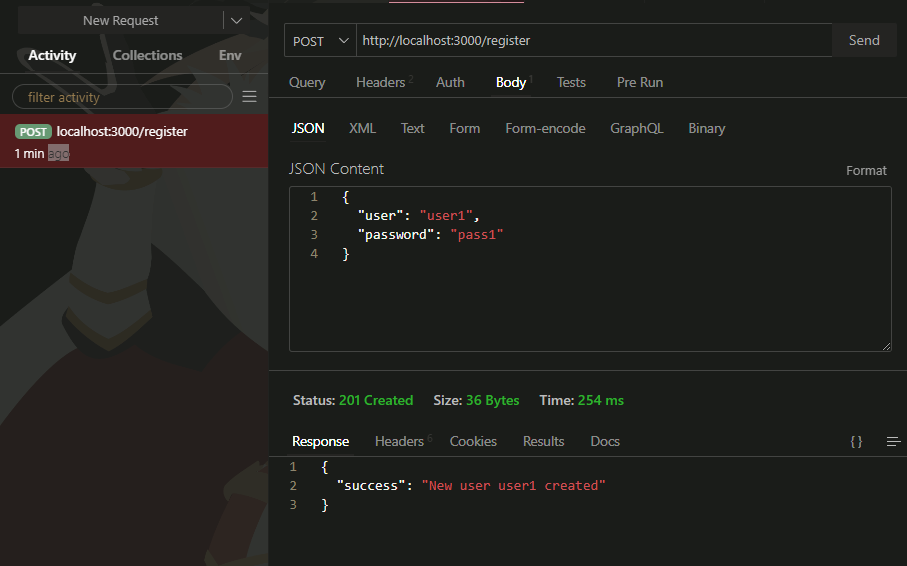
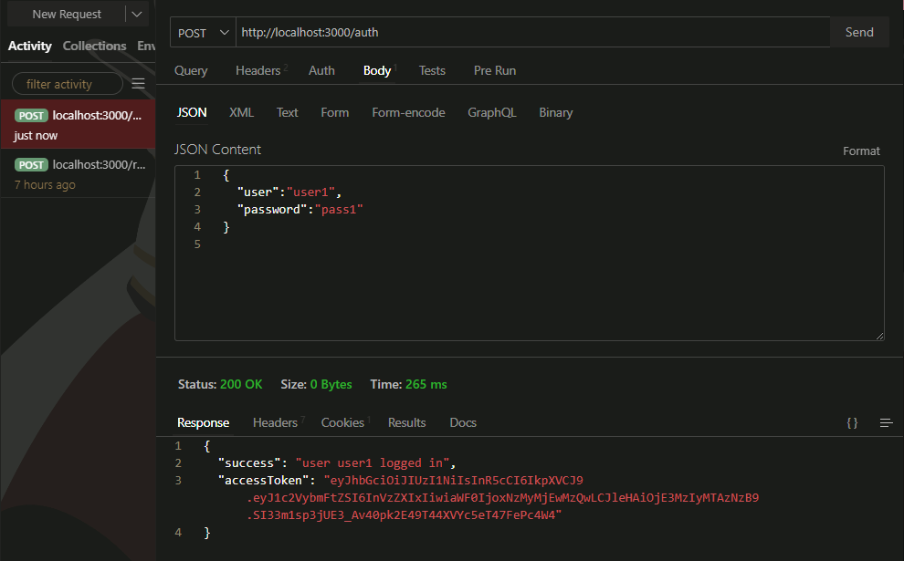
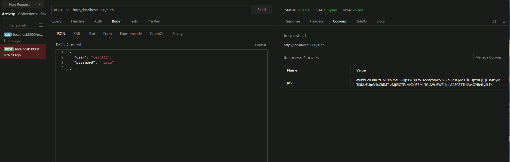
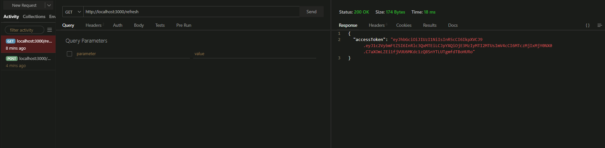

# projekt_bawim_jwt

Celem zadań jest zaznajomienie studentów z ExpressJS i technologią Json Web Token. 

<b>Wstęp:</b>
ExpressJS jest to szybki, web, backendowy framework. Używany jest ze względu na swoją prostotę, przez co idealnie nadaje się do nauki podstawowych funkcji.
<ul>
<li><b>Zadanie nr 1</b> będzie miało na celu pokazanie podstaw działania tego framework'u, strukturą plików i przygotowaniem do implementacji JWT.</li>
<li><b>Zadanie nr 2 & 3</b> pokażą podstawową implementację i testowanie JWT na podstawie struktury plików z zadania no 1.</li>
</ul>
Zachęca się do robienia zadań po kolei, ale w przypadku, gdy ktoś jest zaznajomiony z ExpressJS, można pobrać pliki z folderu <i>fin_Zadanie_1</i> i przejść do kolejnych zadań.<br><br>
<b>Zalecane jest korzystanie z VSC i zainstalowanie na nim rozszerzenia Thunder Client</b>
<br><br>

<h1>Zadanie nr 1</h1>
<b>Proszę pobrać pliki z folderu <i>Zadanie_1</i></b>
Express, to proste narzędzie do budowania backendu. W nim można definiować jak zachowa się serwer np. jakie pliki zwróci, co zmieni w bazie danych, na podstawie akcji wykonanych przez użytkownika.
W plikach, które znajdują się w folderze dla tego zadania, i które nas interesują, można znaleźć:
<ul>
  <li><b>server.js</b> - jest to nasz główny plik</li>
  <li><b>package.json</b> - jest to plik, w którym znajdują się informacje dot. projektu, jego zależności (z jakich bibliotek korzystamy), definicje skryptów uruchamiających aplikację itd.</li>
  <li><b>w odpowiednich folderach pliki statyczne index.html i styles.css</b></li>
</ul>
W celu uruchomienia serwera należy wpisać komendy (pierwsza pobierze biblioteki, druga uruchomi serwer): 

```
npm i
npm run dev
```
Żeby serwer zwrócił nam stronę należy dodać do niego kod: 

```javascript
app.get('/', (req, res) => {
    res.sendFile(path.join(__dirname, 'src', 'index.html'))
})
```
Tak wygląda podstawowy route, można sprawdzić jego działanie na stronie 

```
http://localhost:3000/
```
W kolejnych zadaniach struktura nie będzie jednak taka prosta.
Żeby zachować czystość kodu, stworzymy foldery według następującej topologii:
```
|-controllers //do trzymania plików "kontrolerów"
|-middleware  //do trzymania plików "middleware"
|-model //do trzymania plików json imitujących bazy danych
|-de_modules (istnieje)
|-public|
        |-css (istnieje)
|-routes //do trzymania "ścieżek"
|-src (istnieje)
```
W folderze controllers należy stworzyc plik **main_contr.js** i umieścić w nim

```javascript
const path = require('path')

const handle_main = (req, res) => {
    res.sendFile(path.join(__dirname, "..", 'src', 'index.html'))
}

module.exports = { handle_main }
```
działa to jako osobny moduł który zwraca w tym przypadku wymagany plik.
Mamy tutaj funkcję strzałkową, która jako argumenty przyjmuje **req** i **res**.
Tłumacząc prosto
<ul>
  <li>req - to są dane przyjmowane</li>
  <li>res - dane zwracane</li>
</ul>

W folderze routes należy stworzyc plik **main_route.js** i umieścić w nim:

```javascript
const express = require('express')
const router = express.Router()
const handle_contr = require('../controllers/main_contr')

router.get('/', handle_contr.handle_main)

module.exports = router;
```
Tutaj importujemy moduł wcześniej stworzony i tworzymy ścieżkę, działającą jak wcześniej, ale zamiast tutaj pisać kod, korzystamy z modułu kontrolera. 
<br> <br>
Żeby sprawdzić działanie, należy przejść do pliku server.js, zakomentować poprzednią ścieżkę i wkleić:

```javascript
app.use('/', require('./routes/main_route.js'))
```
<br><br>
<h1>Zadanie nr 2</h1>
<h2>1.Tworzenie pliku .env i 'bazy danych'</h2>
Rozpoczynając kolejne zadania, należy stworzyć w folderze głównym plik <b>.env</b> zawierający zmienne środowiskowe.
W nim korzystając z terminala node (komenda node) należy wygenerować 2 różne stringi wielkości 64 bajtów.

```
require('crypto').randomBytes(64).toString('hex')
```
i umieścić je w nim:

```
ACCESS_TOKEN_SECRET=string_1
REFRESH_TOKEN_SECRET=string_2
```
Do testów proszę również stworzyć plik **users.json** w folderze model z zawartością:

```
[]
```
<h2>2.Tworzenie kontrolera rejestracji</h2>
W folderze controllers należy stworzyć plik, w którym napiszemy kontroler do rejestracji.
Na samej górze tego pliku musimy zainicjować nasza bazę danych (czyli plik users.json). Wygląd tego kodu może przypominać useState z ReactJS i działa to podobnie:

```javascript
const usersDB = {
    users: require('../model/users.json'), 
    setUsers: function (data) {
        this.users = data
    }
}// usersDB.users -> pobranie zawartości, usersDB.serUsers() -> nadpisanie zawartości 
```
Potem musimy zainicjować biblioteki, których będziemy używać:

```javascript
const fsPromises = require('fs').promises //do edycji pliku 
const path = require('path') //do tworzenia ścieżek
const bcrypt = require('bcrypt') //do hashowania
```
Następnie tworzymy funkcję **handleNewUser** (asynchroniczną, ponieważ fsPromises i bcrypt są asynchroniczne)

```javascript
const handleNewUser = async (req, res) => {
}
module.exports = { handleNewUser }
```

i w niej:
<ol>
  <li>Pobieramy dane od użytkownika</li>
  <li>Sprawdzamy, czy użytkownik istnieje i w takim przypadku zwracamy odpowiedni status</li>
  <li>Hashujemy hasło użytkownika i dodajemy go do bazy danych</li>
</ol>
Pomocny kod:

```javascript
const { user, password } = req.body //pobranie wartości {login, hasło}
res.status(409).json({ 'message': 'user exists' }) //wysłanie statusu 409 z custom wiadomością
const hashedPassword = await bcrypt.hash(password, 10) //hashowanie hasła
await fsPromises.writeFile(path.join(__dirname, '..', 'model', 'users.json'), JSON.stringify(usersDB.users)) //nadpisywanie pliku users.json nowymi danymi
```
<b>Zachęcamy do samodzielnego podejścia do problemu. W przypadku trudności można spojrzeć do folderu fin_Zadanie_2_2 i zaczerpnąć inspiracji.</b>
Następnym krokiem w tym podpunkcie jest jedynie podpięci tego kontrolera do (wymagającego stworzenia) pliku ścieżki w folderze routes i dodania odpowiedniej ścieżki w głównym serwerze.
Wszystko analogicznie do **Zadania no 1**. 

<h3>Testowanie</h3>
W celu przetestowania, najłatwiej skorzystać z rozszerzenia do VSC o nazwie: Thunder Client.
Żeby z niego skorzystać, trzeba: 
<ol>
<li>Stworzyć nowy request (klikając New Request)</li>
<li>Wybrać odpowiednią metodę (Post)</li>
<li>Wpisać odpowiedni adres (http://localhost:3000/register)</li>
<li>Uzupełnić body odpowiednimi danymi w formacie .json</li>
</ol>
Przykładowo:


<h2>3.Tworzenie kontrolera autentykacji</h2>
Po zabawie z samym expressem przyszedł czas na JWT. <br>
Należy stworzyć kolejny plik w folderze controllers. <br>
W nim podobnie jak w poprzednim podpunkcie należy:
<ol>
  <li>Zainicjować bazę danych (plik)</li>
  <li>Zainicjować biblioteki (w tym nową <i>jsonwebtoken</i>) i plik ze zmiennymi środowiskowymi:
    
  ```javascript
  const bcrypt = require('bcrypt')
  const jwt = require('jsonwebtoken')
  require('dotenv').config()
  const fsPromises = require('fs').promises
  const path = require('path')
  ```
  </li>
  <li>Stworzyć asynchroniczną funkcję <b>handleLogin</b>: 

  ```javascript
  const handleLogin = async (req, res) => {
  }
  module.exports = { handleLogin }
  ```
  </li>
</ol>

Dane które tutaj przyjmujemy, to dane logowania, więc przydałoby się najpierw sprawdzić, czy taki użytkownik istnieje i czy jego hasło jest poprawne.<br>
Do sprawdzenia hasła powinno posłużyć np: 

```javascript
const match = await bcrypt.compare(haslo_wpisane, haslo_z_bazy_danych) //zwraca boolean, true w przypadku poprawnego porównania
```
W instrukcji warunkowej, gdy hasło się zgadza, możemy stworzyć nasze tokeny.

```javascript
  const accessToken = jwt.sign(
      { 'username': nazwa_uzytkownika },
      process.env.ACCESS_TOKEN_SECRET,
      { expiresIn: '30s' } //15m normally
  )

  const refreshToken = jwt.sign(
      { 'username': nazwa_uzytkownika },
      process.env.REFRESH_TOKEN_SECRET,
      { expiresIn: '1d' }
  )
```
Tworzymy dwa tokeny: 
<ul>
<li>Access - jest to token o krótkiej dacie ważności, na potrzeby testów można ustawić ją na 30 sekund, </li>
<li>Refresh - token o długiej dacie ważności, potrzebny do tworzenia nowych access tokenów</li>
</ul>
Dodatkowo warto nadmienić, że refresh tokeny będziemy umieszczać w ciasteczkach, ale typu httpOnly, który sprawia, że nie ma do nich dostępu z poziomu JS i dorzycimy je do bazy danych<br>
Access tokeny odeślemy w postaci jsona spowrotem do użytkownika<br><br>
<b>Przykładowy kod implementacji:</b>

```javascript
const otherUsers = usersDB.users.filter(person => person.username !== foundUser.username) //wybieramy wszystkich użytkowników innych od naszego
const currentUser = { ...foundUser, refreshToken } //dodajemy refreshtoken do obiektu użytkownika
usersDB.setUsers([...otherUsers, currentUser]) //dodajemy zaktualizowany obiekr użytkownika do bazy
await fsPromises.writeFile(
    path.join(__dirname, '..', 'model', 'users.json'),
    JSON.stringify(usersDB.users)
)//aktualizujemy plik bazy danych

res.cookie('jwt', refreshToken, { httpOnly: true, maxAge: 24 * 60 * 60 * 1000 }) //wysyłanie httpOnly cookie
res.json({ 'success': `user ${nazwa_uzytkownika} logged in`, 'accessToken': accessToken }) //wysyłanie access tokena do użytkownika
```
<br><b>Jedyne co pozostało, to analogicznie do wcześniejszych podpunktów stworzyć ścieżkę w folderze routes i dodanie jej do głównego pliku serwera.</b>

<h3>Testowanie</h3>
Korzystając z Thunder Client, należy wysłać login i hasło naszego, wcześniej utworzonego użytkownika na odpowiedni adres.<br><br>
Wynik powinien być następujący:


<h1>Zadanie nr 3</h1>
Jak można było zauważyć, nasz access token bardzo szybko się 'zużywa'. Należy zatem zaimplementować mechanizm, który na podstawie refresh tokena, którego mamy w httpOnly cookie, stworzy i wyśle nowego, świeżego access tokena.
<br><br>Tak jak wyżej, przygotowujemy nowy kontoler i inicjujemy w nim bazę danych i wymaganą bibliotekę jwt, a także plik .env.<br>

```javascript
const usersDB = {
    users: require('../model/users.json'),
    setUsers: function (data) {
        this.users = data
    }
}
const jwt = require('jsonwebtoken')
require('dotenv').config()
```
Tworzymy również nową funkcję, ale tym razem nie będzie ona asynchroniczna. Dodatkowo dobieramy się w niej do zawartości ciasteczek, a konkretnie <b>cookies.jwt</b>. To ciasteczko jest naszym refresh tokenem.

```javascript
const handleRefreshToken = (req, res) => {
const cookies = req.cookies 
if (!cookies?.jwt) return res.sendStatus(401) //sprawdzenie, czy istnieją jakiekolwiek ciasteczka JWT
console.log(cookies.jwt) //pokazanie naszego refresh tokena
}
module.exports = { handleRefreshToken }
```
Następnym krokiem jest znalezienie użytkownika o danym refresh tokenie, co nie będzie trudne, bo refresh tokeny przechowujemy w bazie danych
<br><br>
Gdy będziemy mieli znalezionego użytkownika należy zweryfikować jego refreshtoken pod względem autentyczności. Posłuży nam do tego nasz podpis, który daliśmy mu przy jego generowaniu. 

```javascript
jwt.verify(
    refreshToken, //znaleziony refresh token
    process.env.REFRESH_TOKEN_SECRET, //nasza zmienna środowiskowa
    (err, decoded) => {
        if (err || foundUser.username !== decoded.username) return res.sendStatus(403) //sprawdzenie czy nazwa użytkownika z refresh tokenu zgadza się z tą z bazy danych
        const accessToken = jwt.sign(
            { "username": decoded.username },
            process.env.ACCESS_TOKEN_SECRET,
            { expiresIn: '30s' }
        ) //utworzenie nowego access tokenu
        res.json({ accessToken }) //wysłanie go
    }
)
```
W taki sposób użytkownik z aktywnym refresh tokenem jest w stanie otrzymać nowy access token, bez konieczności ponownego logowania.
Przed testami należy stworzyć kolejną ścieżkę w nowym pliku, a także dodać ją do głównego pliku serwera.<br><br>
Żeby jednak nasz serwer mógł odczytywać pliki cookies. Należy na samą górę dodać:<br>

```javascript
const cookieParser = require('cookie-parser')
```
a niżej w kodzie:<br>

```javascript
app.use(cookieParser())
```

<h3>Testowanie</h3>
Żeby przetestować odświeżanie, należy najpierw skorzystać z wcześniejszego requesta i zalogować się. W odpowiedzi, w zakładce <b>Cookies</b> otrzymamy nasze ciasteczko JWT, można sobie je tam podejrzeć.
Następnie, wystarczy wysłać jedno zapytanie metodą GET, na ścieżce z tego zadania. W odpowiedzi otrzymujemy access token. <br>


<br>
<h1>Dziękujemy za uwagę!</h1>


